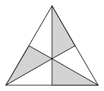
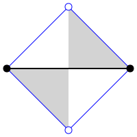
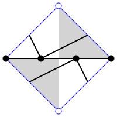
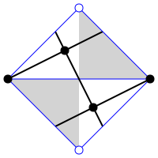

Notes on Conway operators
=========================

Conway originally defined a set of operations that could be performed on the
Platonic solids to obtain the Archimedean and Catalan solids. Although some of
the operations date back as early as Kepler, operations that obtain one
polyhedron using another one as a seed as now known as Conway operations or
Conway operators. Conway's original set of operations is denoted with the
letters `abdegjkmost`, and more are available depending on your software. For
instance, a truncated cube may be denoted `tC`, where `t` is the truncate
operation and `C` is a cube. Initially there was not much theory supporting
Conway operations, but [Brinkmann]_'s paper provides a framework. This text
is an attempt to use Brinkmann's work to find ways to better quantify and
analyze Conway operators.

Preliminaries
-------------
This assumes some familiarity with Conway operators. See [HartConway]_ for a
basic overview, or better still, spend some time playing with
[Polyhedronisme]_ (a web app) or ``conway`` in [Antiprism]_.
In general, this text uses the same terms as ``conway``.

Antiprism uses `S` (seed) for the identity operator. The dual operator is `d`,
and the mirror-image operator is `r`. Both `dd` and `rr` equal `S`. For every
operator `x`, there also exist operators `xd`, `dx`, and `dxd`, some of which
may be equal to `x`. Since the characteristics of the latter operators
are closely related to `x`, this text will generally pick one operator from
that collection and use that to represent the whole. (Usually the choice is
an operator that preserves the base vertices, for consistency's sake.)

An operator that cannot be expressed in terms of operators aside from `d` and
`r` is "primitive". For instance, `k` (Kis) and `j` (Join) are primitive,
but `m` (Meta) is not; it is equal to `kj`.

Chamber structure
-----------------

   Chambers of a triangular face.

   Chambers adjacent to an edge.

[Brinkmann]_ observed that Conway operators can be described in terms of
chambers. Each face may be divided into chambers by identifying the face center
and drawing lines from there to each vertex and edge midpoint.
The operator may then be specified by a structure within those chambers. If an
operator is achiral, the grey chamber is a reflection of the adjacent white
chamber. Technically we only need the upper-left white chamber for achiral
operators or the upper white and grey chambers for chiral operators,
but showing both sides of the edge will make things easier later on.

There is some freedom in where vertices are placed within the chambers.
This is more apparent with chiral operators. Often the operator is drawn
so that most of the vertices lie on the seed edge, but this is not necessary.
For instance, the image on the left is a chamber diagram for how George Hart
originally drew his propeller operator (see [HartPropeller]_),
but the image on the right is topologically
equivalent and emphasizes the operator's relationship with a square grid.

Operators on counts
-------------------
When `x` is the operator, :math:`[v,e,f]` are the vertices, edges, and faces of
the seed, and :math:`[v',e',f']` are the vertices, edges, and faces of the
result, then :math:`[v',e',f'] = \mathbf{M}_x [v,e,f]`.

.. math::
   \mathbf{M}_x = \begin{bmatrix}
   a & b & c \\
   0 & g & 0 \\
   a' & b' & c' \end{bmatrix}

where a + a' = 1, c + c' = 1, and g= b + b' + 1, and a, a', b, b', c, and c'
are all nonnegative integers. a, a', c, c' to be {0, 1}, and g is a positive
integer.

A more elaborate representation is as an infinite linear operator. Let `e` and
`e'` be the count of edges before and after like above, but now :math:`v_i` and
:math:`v'_i` are the count of vertexes of order `i` before and after, antipodal
:math:`f_i` and :math:`f'_i` are the count of faces with `i` sides.
:math:`\sum v_i = v`, and so on for the rest of these.

.. math::
   e' &= ge

   v'_i &= a v_{i/k} + e b_i + c f_{i/\ell}

   f'_i &= a' v_{i/k} + e b'_i + c' f_{i/\ell}

where :math:`\sum b_i = b`, :math:`\sum b'_i = b'`, all :math:`b_i` and
:math:`b'_i` are nonnegative integers, and `k` and :math:`\ell` are positive
integers. The subscripts `i/k` should be interpreted as
0 if `i/k` is not an integer.

Relation to the Goldberg-Coxeter operation
------------------------------------------

Extensions
----------
allow a, a', c, c' to be {0, 1/2, 1}

.. math::
   e' &= ge

   v'_i &= a (v_{i/k_1} + v_{i/k_2})/2 + e b_i + c (f_{i/\ell_1} + f_{i/\ell_2})/2

   f'_i &= a' (v_{i/k_1} + v_{i/k_2})/2 + e b'_i + c'(f_{i/\ell_1} + f_{i/\ell_2})/2

dealing with digons and order-2 vertices

Table of values
---------------
.. list-table::

   * - Operator
     - Chiral?
     - Chambers
     - Matrix
     - :math:`k, \ell`
     - :math:`b_i`, :math:`b'_i`
     - Useful relations
   * - `S` (Seed, Identity)
     - N
     - .. image:: edge_chambers.svg
     - .. math::
        \begin{bmatrix}
        1 & 0 & 0 \\
        0 & 1 & 0 \\
        0 & 0 & 1 \end{bmatrix}
     - 1, 1
     -
     -
   * - `d` (Dual)
     - N
     - .. image:: edge_chambers_dual.svg
     - .. math::
          \begin{bmatrix}
          0 & 0 & 1 \\
          0 & 1 & 0 \\
          1 & 0 & 0 \end{bmatrix}
     - 1, 1
     -
     - `dd = S`
   * - `j` (Join)
     - N
     - .. image:: edge_chambers_join.svg
     - .. math::
          \begin{bmatrix}
          1 & 0 & 1 \\
          0 & 2 & 0 \\
          0 & 1 & 0 \end{bmatrix}
     - 1, 1
     - :math:`b'_4=1`
     - `j = jd = da = dad`
   * - `k` (Kis)
     - N
     - .. image:: edge_chambers_kis.svg
     - .. math::
          \begin{bmatrix}
          1 & 0 & 1 \\
          0 & 3 & 0 \\
          0 & 2 & 0 \end{bmatrix}
     - 2, 1
     - :math:`b'_3=2`
     - `k = nd = dz = dtd`
   * - `g` (Gyro)
     - Y
     - .. image:: edge_chambers_gyro.svg
     - .. math::
          \begin{bmatrix}
          1 & 2 & 1 \\
          0 & 5 & 0 \\
          0 & 2 & 0 \end{bmatrix}
     - 1, 1
     - :math:`b_3=2`, :math:`b'_5=2`
     - `g = gd = ds = dsd`
   * - `p` (Propeller)
     - Y
     - .. image:: edge_chambers_propeller.svg
     - .. math::
          \begin{bmatrix}
          1 & 2 & 0 \\
          0 & 5 & 0 \\
          0 & 2 & 1 \end{bmatrix}
     - 1, 1
     - :math:`b_4=2`, :math:`b'_4=2`
     - `p = dpd`
   * - `c` (Chamfer)
     - N
     - .. image:: edge_chambers_chamfer.svg
     - .. math::
          \begin{bmatrix}
          1 & 2 & 0 \\
          0 & 4 & 0 \\
          0 & 1 & 1 \end{bmatrix}
     - 1, 1
     - :math:`b_3=2`, :math:`b'_6=1`
     - `c = dud`
   * - `l` (Loft)
     - N
     - .. image:: edge_chambers_loft.svg
     - .. math::
          \begin{bmatrix}
          1 & 2 & 0 \\
          0 & 5 & 0 \\
          0 & 2 & 1 \end{bmatrix}
     - 2, 1
     - :math:`b_3=2`, :math:`b'_4=2`
     -
   * - `q` (Quinto)
     - N
     - .. image:: edge_chambers_quinto.svg
     - .. math::
          \begin{bmatrix}
          1 & 3 & 0 \\
          0 & 6 & 0 \\
          0 & 2 & 1 \end{bmatrix}
     - 1, 1
     - :math:`b_3=2`, :math:`b_4=1`, :math:`b'_5=2`
     -
   * - :math:`K_0` (Join-stake)
     - N
     - .. image:: edge_chambers_join-stake.svg
     - .. math::
          \begin{bmatrix}
          1 & 2 & 1 \\
          0 & 6 & 0 \\
          0 & 3 & 0 \end{bmatrix}
     - 2, 1
     - :math:`b_3=2`, :math:`b'_4=3`
     -
   * - :math:`K` (Stake)
     - N
     - .. image:: edge_chambers_stake.svg
     - .. math::
          \begin{bmatrix}
          1 & 2 & 1 \\
          0 & 7 & 0 \\
          0 & 4 & 0 \end{bmatrix}
     - 3, 1
     - :math:`b_3=2`, :math:`b'_3=2`, :math:`b'_4=2`
     -
   * - :math:`L_0` (Join-lace)
     - N
     - .. image:: edge_chambers_join-lace.svg
     - .. math::
          \begin{bmatrix}
          1 & 2 & 0 \\
          0 & 6 & 0 \\
          0 & 3 & 1 \end{bmatrix}
     - 2, 1
     - :math:`b_4=2`, :math:`b'_3=2`, :math:`b'_4=1`
     -
   * - :math:`L` (Lace)
     - N
     - .. image:: edge_chambers_lace.svg
     - .. math::
          \begin{bmatrix}
          1 & 2 & 0 \\
          0 & 7 & 0 \\
          0 & 4 & 1 \end{bmatrix}
     - 3, 1
     - :math:`b_4=2`, :math:`b'_3=4`
     -
   * - :math:`w` (Whirl)
     - Y
     - .. image:: edge_chambers_whirl.svg
     - .. math::
          \begin{bmatrix}
          1 & 4 & 0 \\
          0 & 7 & 0 \\
          0 & 2 & 1 \end{bmatrix}
     - 1, 1
     - :math:`b_3=4`, :math:`b'_6=2`
     -
   * - :math:`J=(kk)_0` (Join-kis-kis)
     - N
     - .. image:: edge_chambers_join-kis-kis.svg
     - .. math::
          \begin{bmatrix}
          1 & 2 & 0 \\
          0 & 8 & 0 \\
          0 & 5 & 1 \end{bmatrix}
     - 3, 2
     - :math:`b_3=2`, :math:`b'_3=1`, :math:`b'_4=4`
     -
   * - :math:`X` (Cross)
     - N
     - .. image:: edge_chambers_cross.svg
     - .. math::
          \begin{bmatrix}
          1 & 3 & 1 \\
          0 & 10 & 0 \\
          0 & 6 & 1 \end{bmatrix}
     - 2, 2
     - :math:`b_4=2`, :math:`b_6=1`, :math:`b'_3=4`, :math:`b'_4=2`
     -
   * - :math:`W` (Waffle) (New)
     - N
     - .. image:: edge_chambers_waffle.svg
     - .. math::
          \begin{bmatrix}
          1 & 4 & 1 \\
          0 & 9 & 0 \\
        0 & 4 & 0 \end{bmatrix}
     - 1, 1
     - :math:`b_3=2`, :math:`b_4=2`, :math:`b'_4=2`, :math:`b'_5=2`
     -
   * - :math:`B` (Bowtie) (New)
     - Y
     - .. image:: edge_chambers_bowtie.svg
     - .. math::
          \begin{bmatrix}
          1 & 5 & 1 \\
          0 & 10 & 0 \\
          0 & 4 & 0 \end{bmatrix}
     - 1, 1
     - :math:`b_3=4`, :math:`b_4=1`, :math:`b'_3=2`, :math:`b'_7=2`
     - `rB=Bd`
   * - :math:`m_n` (Meta)
     - N
     -
     - .. math::
          \begin{bmatrix}
          1 & n & 1 \\
          0 & 3n+3 & 0 \\
          0 & 2n+2 & 1 \end{bmatrix}
     - 2, n
     - :math:`b_4=n`, :math:`b'_3=2n+2`
     - :math:`m_1 = m = kj`
   * - :math:`M_n` (Medial)
     - N
     -
     - .. math::
          \begin{bmatrix}
          1 & n & 1 \\
          0 & 3n+1 & 0 \\
          0 & 2n & 1 \end{bmatrix}
     - 1, n
     - :math:`b_4=n`, :math:`b'_3=2n-2`, :math:`b'_4=2`
     - :math:`M_1 = o = jj`
   * - :math:`\Delta_{a,b}` if T divisible by 3
     - If :math:`a \ne b` and :math:`b \ne 0`
     -
     - .. math::
          \begin{bmatrix}
          1 & T/3-1 & 1 \\
          0 & T & 0 \\
          0 & 2T/3 & 0 \end{bmatrix}
     - 1, 1
     - :math:`b_6=b`, :math:`b'_3=b'`
     - :math:`\Delta_{2,0} = u`
   * - :math:`\Delta_{a,b}` if T not divisible by 3
     - If :math:`a \ne b` and :math:`b \ne 0`
     -
     - .. math::
          \begin{bmatrix}
          1 & (T-1)/3 & 0 \\
          0 & T & 0 \\
          0 & 2(T-1)/3 & 1 \end{bmatrix}
     - 1, 1
     - :math:`b_6=b`, :math:`b'_3=b'`
     - :math:`\Delta_{1,1} = n`, :math:`\Delta_{2,1} = dwd`
   * - :math:`\Box_{a,b}` if T even
     - If :math:`a \ne b` and :math:`b \ne 0`
     -
     - .. math::
          \begin{bmatrix}
          1 & T/2-1 & 1 \\
          0 & T & 0 \\
          0 & T/2 & 0 \end{bmatrix}
     - 1, 1
     - :math:`b_4=b`, :math:`b'_4=b'`
     - :math:`\Box_{a,b} = \Box_{a,b}d`,
       :math:`\Box_{1,1} = j`, :math:`\Box_{2,0} = o = j^2`
   * - :math:`\Box_{a,b}` if T odd
     - If :math:`a \ne b` and :math:`b \ne 0`
     -
     - .. math::
          \begin{bmatrix}
          1 & (T-1)/2 & 0 \\
          0 & T & 0 \\
          0 & (T-1)/2 & 1 \end{bmatrix}
     - 1, 1
     - :math:`b_4` :math:`=b'_4` :math:`=b` :math:`=b'`
     - :math:`\Box_{a,b} = d\Box_{a,b}d`, :math:`\Box_{1,2} = p`
