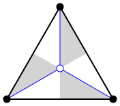
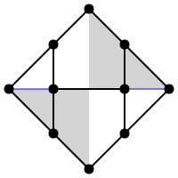
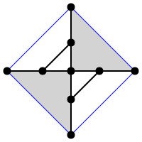
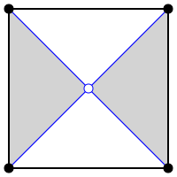
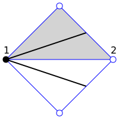
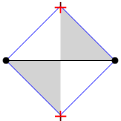

Notes on Conway operators
=========================

Conway originally defined a set of operations that could be performed on the
Platonic solids to obtain the Archimedean and Catalan solids. Although some of
the operations date back as early as Kepler, operations that obtain one
polyhedron using another one as a seed as now known as Conway operations or
Conway operators. Conway's original set of operations is denoted with the
letters `abdegjkmost`, and more are available depending on your software. For
instance, a truncated cube may be denoted `tC`, where `t` is the truncate
operation and `C` is a cube. Initially there was not much theory supporting
Conway operations, but [Brinkmann]_'s paper provides a framework. This text
is an attempt to use Brinkmann's work to find ways to quantify, analyze,
and expand Conway operators.

Preliminaries
-------------
This assumes some familiarity with Conway operators. See [HartConway]_ for a
basic overview, or better still, spend some time playing with
[Polyhedronisme]_ (a web app) or ``conway`` in [Antiprism]_.
In general, this text uses the same terms as ``conway``.

Antiprism uses `S` (seed) for the identity operator. The dual operator is `d`,
and the mirror-image operator is `r`. Both `dd` and `rr` equal `S`. For every
operator `x`, there also exist operators `xd`, `dx`, and `dxd`, some of which
may be equal to `x`. Since the characteristics of the latter operators
are closely related to `x`, this text will generally pick one operator from
that collection and use that to represent the whole. (Usually the choice is
an operator that preserves the base vertices, for arbitrary consistency's sake.)

An operator that cannot be expressed in terms of operators aside from `d` and
`r` is "irreducible". For instance, `k` (Kis) and `j` (Join) are irreducible
in terms of Conway operators, but `m` (Meta) is not (it is equal to `kj`).

Conway operations are usually applied to convex (spherical) polyhedra, and less
often on planar tilings. Planar tilings can be easier to visualize.

Faces with `k` sides may be called `k`-degree faces, by analogy with `k`-degree
vertices.

Chamber structure
-----------------
.. _facechambers:

   Chambers of a triangular face.

.. _edgechambers:
.. figure:: edge_chambers.svg
   :align: right
   :figwidth: 25%

   Chambers adjacent to an edge.

[Brinkmann]_ et al. observed that Conway operators can be described in terms
of chambers. Each face may be divided into chambers by identifying the face
center and drawing lines from there to each vertex and edge midpoint, as in
:numref:`facechambers`. Similarly, each vertex of degree `n` is surrounded
by `n` white and `n` grey chambers. Each edge has a white and grey chamber on
each side of the edge, as shown in :numref:`edgechambers`.

The operator may then be specified by a structure of vertices and edges within
those chambers, possibly with edges crossing from one edge to another. If an
operator is achiral, the grey chamber is a reflection of the adjacent white
chamber. A list of operators with their chamber structures is listed at the
end of this text. In this text, we show the two chambers adjacent to each
side of a seed edge. Technically we only need the upper-left white chamber for
achiral operators or the upper white and grey chambers for chiral operators,
but showing both sides of the edge will make things easier later on.

The chamber structure of the composed operator `xy` can be drawn by applying `x`
to the edges of the chamber structure of `y`. In particular, for a given
operator `x`, the chamber structure of `xd` is simply the chamber structure
of `x` rotated one quarter turn.

There is some freedom in where vertices are placed within the chambers.
This is more apparent with chiral operators. Often the operator is drawn
so that most of the vertices lie on the seed edge, but this is not necessary.
For instance, :numref:`propeller` is a chamber diagram for how George Hart
originally drew his propeller operator (see [HartPropeller]_),
but :numref:`propellersq` is topologically
equivalent and emphasizes the operator's relationship with a square grid.

.. _propeller:
.. figure:: edge_chambers_propeller.svg
   :align: center

   George Hart's drawing of the chambers for the operator `p` (Propeller)

.. _propellersq:
.. figure:: edge_chambers_propeller-square_grid.svg
   :align: center

   Grid drawing of the chambers for the operator `p` (Propeller)

Operators on counts
-------------------
In abstract algebraic terms, Conway operators form a monoid: a group without
an inverse, or a semigroup with an identity element. Let :math:`[v,e,f]` be
the count of vertices, edges, and faces of the seed, and :math:`v_i` and
:math:`f_i` be the count of vertices/faces of order `i` such that
:math:`\sum v_i = v` and :math:`\sum f_i = f`. There is a series of monoids and
homomorphisms between the monoids, as so:

* Conway operator `x` (acts on polyhedra)
* Infinite-dimensional linear operator :math:`L_x` (acts on :math:`v_i, e, f_i`)
* 3x3 matrix :math:`M_x` (acts on :math:`[v,e,f]`)
* Eigenvalues of :math:`M_x`

Each bullet will be handled in turn.

The action of the operator on the vertices of degree `i`, edges, and faces with
`i` sides can be described with an infinite linear operator :math:`L_x`. This
operator can be determined by counting elements off the chamber structure.
Step by step:

* Seed vertices are either retained or converted into faces centered on that
  vertex. (Other options are precluded by symmetry). Let `a = 1` if the
  seed vertices are retained, and 0 otherwise. Also, the degree of the vertex
  or face is either the same as the seed vertex, or a multiple of it; let `k`
  be that multiple.
* Seed face centers are either retained (possibly of in a smaller face) or
  converted into vertices. (Again, other options are precluded by symmetry).
  Let `c = 0` if the seed faces are retained, and 1 otherwise. Let :math:`\ell`
  serve a similar role as `k` above: the degree of the vertex or face
  corresponding to the seed face center is `k` times the degree of
* Except for the faces or vertices corresponding to the seed vertices and face
  centers, the added elements are in proportion to to the number of
  edges in the seed. `g` is the count of added edges (the edge multiplier or
  inflation rate from [Brinkmann]_ et al.),
  :math:`b_i` is the number of vertices of degree i added,
  and :math:`b'_i` is the number of faces of degree i added.

Count elements lying on or crossing the outer edge of the chamber structure as
half. It may help to draw an adjacent chamber, particularly when determining
the number of sides on a face. The result of the counting process can be
described in the following operator form;
variables in capital letters are the result of the operator.

.. math::
   E &= ge

   V_i &= a v_{i/k} + e b_i + c f_{i/\ell}

   F_i &= a' v_{i/k} + e b'_i + c' f_{i/\ell}

where `a`, :math:`a'`, `c`, and :math:`c'` are either 0 or 1, `g` is a
positive integer, all :math:`b_i` and :math:`b'_i` are nonnegative integers,
and `k` and :math:`\ell` are positive integers. The subscripted values like
:math:`v_{i/k}` should be interpreted as 0 if `i/k` is not an integer.

Under the constraint that the operator preserves the Euler characteristic,
it can be shown that :math:`a + a' = 1`, :math:`c + c' = 1`, and
:math:`g= b + b' + 1` where :math:`\sum b_i = b` and :math:`\sum b'_i = b'`.
Also, since :math:`b_i` and :math:`b'_i` are nonnegative integers, only a
finite number of their values can be non-zero. This makes the operator form
more manageable than the term "infinite linear operator" may suggest; in
reality, nearly all applications will only use a finite number of different
vertex and face degrees.

Applying the handshake lemma gives relations between the values:

.. math::
   2g &= 2ak + 2c\ell + \sum i b_i

   2g &= 2a'k + 2c'\ell + \sum i b'_i

These can be manipulated into this form:

.. math::
   2k + 2l - 4 = \sum (4-i) (b_i + b'_i)

which is interesting because it eliminates `g`, `a` and `c`,
and because it suggests that features with degree 5 or more exist
in balance with features of degree 3 (triangles and degree-3 vertices),
and that in some sense degree 4 features come "for free".

If the polyhedron doesn't have degree-2 features (e.g digons or degree-2
vertices), :math:`i \ge 3`. Together with characteristics from above, a
series of inequalities can be derived:

.. math::
   2k + 2\ell - 2 \le g + 1 \le 2a + 3b + 2c \le 2g

All these relations taken together  are necessary but not sufficient. The values
:math:`g=3`, :math:`a=1`, :math:`c=0`, :math:`k=1`, :math:`\ell=1`,
:math:`b_4=1`, :math:`b'_4=1` satisfy the relations, but do not appear
to correspond to any Conway operator. (However, see the "Extensions" section.)

The dual operator :math:`L_d` has the form :math:`E = e, V_i = f_i, F_i = v_i`.
With a little manipulation, it is easy to see that if :math:`L_x` has values
`a`, :math:`b_i`, `c`, etc, then applications of the dual operator have related
forms. :math:`L_x L_d`'s values exchange `a` with `c`, :math:`a'` with
:math:`c'`, and `k` with :math:`\ell`. :math:`L_d L_x`'s values exchange `a`
with :math:`a'`, `c` with :math:`c'`, and each :math:`b_i` with each
:math:`b'_i`. Finally, :math:`L_d L_x L_d`'s values exchange `a` with
:math:`c'`, and :math:`a'` with `c`, `k` with :math:`\ell`,
and each :math:`b_i` with each :math:`b'_i`.

The matrix form :math:`M_x` can be obtained from :math:`L_x` by summing
:math:`\sum v_i = v` and :math:`\sum f_i = f`, or from counting elements
directly from the chamber structure without distinguishing between vertices and
faces of different degrees. (The conversion from :math:`L_x` to :math:`M_x` is
itself a linear operator.) The matrix takes the form:

.. math::
   \mathbf{M}_x = \begin{bmatrix}
   a & b & c \\
   0 & g & 0 \\
   a' & b' & c' \end{bmatrix}

The matrix for the identity operator `S` is just the 3x3 identity matrix.
The matrix for the dual operator is the reverse of that:

.. math::
   \mathbf{M}_d = \begin{bmatrix}
   0 & 0 & 1 \\
   0 & 1 & 0 \\
   1 & 0 & 0 \end{bmatrix}

The dual matrix operates on other matrices by mirroring the values either
horizontally or vertically.

.. math::
   \mathbf{M}_x \mathbf{M}_d = \begin{bmatrix}
   c & b & a \\
   0 & g & 0 \\
   c' & b' & a' \end{bmatrix}, \mathbf{M}_d \mathbf{M}_x  = \begin{bmatrix}
   a' & b' & c' \\
   0 & g & 0 \\
   a & b & c \end{bmatrix}, \mathbf{M}_d \mathbf{M}_x \mathbf{M}_d = \begin{bmatrix}
   c' & b' & a' \\
   0 & g & 0 \\
   c & b & a \end{bmatrix}

The matrix :math:`M_x` has three eigenvalues: `1`, `g`, and
:math:`\Lambda = a-c`. Thus, its determinant is :math:`g(a-c)`. The first
eigenvalue is constant and the second is the edge multiplier defined earlier.
The third, :math:`\Lambda`, is either equal to -1, 0, or 1. The dual operator
interchanges :math:`\Lambda = -1` and :math:`\Lambda = 1`, which gives some
motivation to using operators with `a=1` as the representative operators over
those with `a=0`.

For an operator `xy`, i.e. the composition of `x` and `y`, the expansion factor
`g` is the product of the `g` values for each operator, and :math:`\Lambda` is
the product of each operator's :math:`\Lambda`. For the matrix form, composition
is just the usual matrix multiplication: :math:`M_{xy} = M_x M_y`. Explicitly,
let :math:`g, a, b_i, b'_i, c, k, \ell` be the values for :math:`L_y`;
:math:`G, A, B_i, B'_i, C, K, L` for :math:`L_x`; and
:math:`\gamma, \alpha, \beta_i, \beta'_i, \sigma, \kappa, \lambda`
for :math:`L_{xy}`:

.. math::
   \gamma &= Gg

   \alpha &= Aa + Ca'

   \beta_i &= A b_{i/K} + g B_i + C b'_{i/L}

   \beta'_i &= A' b_{i/K} + g B'_i + C' b'_{i/L}

   \sigma &= Ac + Cc'

.. math::
   \kappa &= \left\{
    \begin{array}{ll}
      Kk & if a=1\\
      Lk & if a=0
    \end{array}
   \right.

   \lambda &= \left\{
    \begin{array}{ll}
      K \ell & if c=1\\
      L \ell & if c=0
    \end{array}
   \right.

.. _waffle:

   The waffle operator (W)

None of these homomorphisms are injections: there are certain
:math:`L_x` or :math:`M_x` that correspond to more than one Conway operator.
Examples for :math:`M_x` are easy to come by: where `n = kd`, :math:`M_k = M_n`.
For an example where the operators are not related by duality,
:math:`M_l = M_p`. For :math:`L_x`, :math:`L_{prp} = L_{pp}` but `prp` is not
the same as `pp` (one's chiral, one's not). For the operator depicted in
:numref:`waffle`, :math:`W \ne Wd`, but :math:`L_W = L_{Wd}`.
(This is a newly named operator, introduced in this text.)

Some further consequences of these representations:

* If a polyhedron has a prime number of edges, then the only Conway operators
  that can be used to express it in terms of another polyhedron are `S` and `d`.
* Operators where `g` is a prime number are irreducible in terms of Conway operators.
* If `x=xd` or `x=rxdr`, :math:`\Lambda = 0`. If `x=dxd` or `x=rdxdr`,
  :math:`\Lambda = \pm 1`.
* If an operator has :math:`\Lambda = \pm 1`, its decomposition cannot contain
  any operators with :math:`\Lambda = 0`. Correspondingly, if an operator has
  :math:`\Lambda = 0`, its decomposition must have at least one operator with
  :math:`\Lambda = 0`.
* There are no Conway operators with `g=2` and :math:`\Lambda = \pm 1`, so
  therefore operators with :math:`\Lambda = \pm 1` and `g=2p`, where p is prime,
  are irreducible in terms of Conway operators.

In summary, the assumptions made in this section are:

#. The operator has a chamber structure like described in [Brinkmann]_.
#. The operator preserves the Euler characteristic of the seed polyhedron.
#. The operator acts on, and produces, a polyhedron with vertices and faces of
   degree 3 or more.
#. The operator affects all vertices, edges, and faces of the seed uniformly.

Chirality
---------
.. _bowtie:

   The bowtie operator (B)

It may be possible to introduce another invariant into these operators and
distinguish operators not discerned by :math:`L_x` or :math:`M_x`. The most
desirable may be a measure for chirality; in theory that would distinguish,
e.g. `pp` vs `prp`. However, this does not appear as simple as assigning
achiral operators to 0 and :math:`\pm 1` to chiral operators. The composition
of a chiral operator and an achiral operator is always chiral, but:

* Two chiral operators can produce an achiral operator: `prp`
* Two chiral operators can produce a chiral operator: `pp`, `pg`, `prg`

Further confusing things are operators where r and d interact. Some
operators have `xd = x`, while some others have `xd = rxr`.
The `gyro` operator is one example of the latter, and the bowtie operator
in :numref:`bowtie` is another, maybe easier-to-visualize example.
(Bowtie is a newly named operator, introduced in this text.)

Relation to the Goldberg-Coxeter operation
------------------------------------------
The Goldberg-Coxeter operation can be fairly simply extended to a Conway
operator. In the master polygon, identify two vertices and the center: this is
the chamber structure of the operator.
GC operators have an invariant `T`, the "trianglation number",
which is identical to the Conway operator edge factor `g`.

* :math:`\Box_{a,b}`: :math:`g = T = a^2 + b^2`
* :math:`\Delta_{a,b}`: :math:`g = T = a^2 + ab + b^2`

:math:`\Box_{a,b}` has :math:`\Lambda = 0` iff :math:`a \equiv b \mod 2`, and
:math:`\Lambda = 1` otherwise. Similarly, :math:`\Delta_{a,b}` has
:math:`\Lambda = 0` iff :math:`a \equiv b \mod 3`. If the operator has
:math:`\Lambda = 0`, the resulting polyhedron will have only quadrilateral
or triangular (respectively) faces; if :math:`\Lambda = 1`, there will be one
face at the face center of the same degree as the seed face.

All of the nice qualities of GC operators carry over to this extension; for
instance, they form a commutative submonoid of Conway operators, and can be
decomposed in relation to the Gaussian or Eisenstein integers. Many of the
named Conway operators are GC operations, or related by duality. GC operators
are also a good source of examples; in the 2-parameter families, it's often
easy to find an operator with a desired quality.

The simplest operators (aside from the identity) are :math:`\Box_{1,1} = j` and
:math:`\Delta_{1,1} = n = kd`. One useful relation is that if a GC operator has
:math:`\Lambda = 0`, it can be decomposed as so:
:math:`\Delta_{a,b} = n \Delta_{(2a+b)/3, (b-a)/3}`, and
:math:`\Box_{a,b} = j\Box_{(a+b)/2,(b-a)/2}`. (These formula may result in
negative values, which should be interpreted as per the section of these docs
on the Goldberg-Coxeter operation.)

Extension - Alternating Operators
---------------------------------
.. _facealtchambers:

   Alternating chambers of a quadrilateral face.

.. _edgealtchambers:
.. figure:: edge_chambers_alternating.svg
   :align: right
   :figwidth: 25%

   Alternating chambers adjacent to an edge.

.. _semi:

   Alternating chambers of the Coxeter semi operator (without digon reduction)

In [Coxeter8]_ (specifically section 8.6), Coxeter defines an alternation
operation `h` on regular polyhedra with only even-sided faces. (He actually
defines it on general polytopes, but let's not complicate things by considering
higher dimensions.) Each face is replaced
with a face with half as many sides, and alternate vertices are either retained
as part of the faces or converted into vertices with number of sides equal to
the degree of the seed vertex. (He also defines a snub operation in section 8.4,
different from the `s` snub Conway defined, that is equivalent to `ht`.) The
alternation operation converts quadrilateral faces into digons. Usually the
digons are converted into edges, but for now, let digons be digons.

This motivates the definition of "alternating operators" and an "alternating
chamber" structure, as depicted in :numref:`facealtchambers` and
:numref:`edgealtchambers`. This structure is only applicable to polyhedra with
even-sided faces. The dual operators of those are applicable to polyhedra with
even-degree vertices, and should be visualized as having chambers on the left
and right rather than top and bottom. Some of these operators can be described
by using one Conway operator for the top half and one for the bottom,
or one for the left half and one for the right. Like Conway operators, the
chamber structure of `xd` is that of `x` rotated a quarter turn; but now,
the direction of rotation matters, and depends on how the alternating vertices
(or faces) of the underlying polyhedron are specified.

These operators depend on the ability to partition vertices into two disjoint
sets, none of which are adjacent to a vertex in the same set; i.e. it applies
to bipartite graphs. By basic graph theory, planar bipartite graphs have faces
of even degree. However, this does not mean that the two sets of vertexes have
the same size, let alone that the sets of vertices of a given degree will
have a convenient partition. The cube and many other
small even-faced polyhedra do partition into two equal sets of vertices, so
beware that examining simple, highly-symmetric polyhedra can be misleading.

Because an alternating operator may transform alternate vertices differently,
and because the size of the sets of alternate vertices (in general or of a
given degree) don't have a fixed ratio or relation, alternating operators do
not in general have representations as :math:`L_x` and :math:`M_x`, at least
as defined earlier. However, alternating operators that have the same effect on
alternating vertices (or faces) can be accommodated in this form. In fact, some
alternating operators may fill in some gaps where no operator exists for
:math:`L_x` or :math:`M_x` as defined earlier, given the constraints; see e.g.
"alternating subdivide" in the list of operators below. The change needed is
to allow :math:`k` and :math:`\ell` to take values in
:math:`\mathbb{N}/2 = \{1/2, 1, 3/2, 2, ...\}`.

Even for the operators that don't fit into the format, the values defined in
:math:`L_x` or :math:`M_x` suggest a way to semi-quantitatively describe these
operators. Allow :math:`a`, :math:`c`, :math:`a'`, and :math:`c'`, to take
values in :math:`\{0, ?, 1\}`, where :math:`?` is the undefined value.
Also define :math:`k_1`, :math:`k_2`, :math:`\ell_1`, and
:math:`\ell_2`, multipliers for the degree of the alternating seed vertices or
faces respectively, which may also take values in :math:`\mathbb{N}/2`.

If :math:`\ell` = 1/2 , the operator creates digons from degree-4 faces.
Similarly, if :math:`k = 1/2`, the operator creates degree-2 vertices from
degree-4 vertices. (The same applies to the :math:`k_i` and :math:`\ell_i`
forms.) The operation of smoothing degree-2 vertices and faces
cannot be represented as a chamber structure (assumption 1),
or in the form :math:`L_x` or
:math:`M_x`. Neither can operations that create degree-2 vertices and faces
be altered to smooth those features while retaining the ability to be
represented as :math:`L_x` or :math:`M_x`. The issue is that the smoothing
operator not only removes degree-2 features, but also affects the degree of
adjacent features, and may affect some features of a certain degree while
leaving others alone. An adjusted :math:`M_x` may be specified as a 5x3 matrix
from :math:`\langle v,e,f,v_4,f_4 \rangle` to :math:`\langle v,e,f \rangle`,
but this is a linear map between two different spaces, not a linear operator,
and isn't as useful compared to the usual :math:`M_x`. (For instance, you can't
multiply the matrices together to represent operator composition.) That being
said, there are two special cases where things become more tractable:
when the seed polyhedron has only quadrilateral faces,
and when the seed polyhedron has faces of degree 6 or more.

In general, alternating operators cannot be composed with other alternating or
Conway operators, because those operators do not necessarily create
even-degree faces or vertices. However, :math:`\Box_{a,b}` operators with
:math:`\Lambda = 0` create polyhedra with quadrilateral faces only. As
mentioned earlier, all :math:`\Box_{a,b}` with :math:`\Lambda = 0` can be
decomposed
into `j` (Join) and some other operator, so it's enough to examine `j`.

Let `$` denote the smoothing operator that reduces degree-2 features, and `@`
denote the operator that exchanges the alternation of the vertices of a seed
polyhedron (equivalently, it reflects the alternating operator).
In the operation `j`, designate the seed vertices as belonging to
partition 1, and the created vertices at face centers as belonging to partition
2. That is, in the edge-centered chamber structure, the vertices on the left
and right are in partition 1, and the ones on the top and bottom are in
partition 2. It is easy to see that, when giving consideration to the
partitioning of vertices, `jd = @j`.

The operator `$xj`, where `x` is an alternating operator, is a Conway operator.
If `x` is an alternating operator that retains both (or neither) partition of
seed vertices (if `a` and `a'` are 0 or 1), then `$xj` has :math:`\Lambda = 0`.
If `x` retains one partition but not the other (if `a` and `a'` are `?`),
then `$xj` has :math:`\Lambda = \pm 1`. Accordingly, these sets of operators
can be called pre-zero and pre-one operators.
Although `$` does not in general have a :math:`M_x` form, in the expression
`$xj` it either does nothing, removes an edge and a vertex, or removes an
edge and a face. These operations can be represented by taking the matrix form
of `xj` and subtracting the zero matrix, or these two following matrices,
respectively:

.. math::
   \begin{bmatrix}
   0 & 1 & 0 \\
   0 & 1 & 0 \\
   0 & 0 & 0 \end{bmatrix} ,
   \begin{bmatrix}
    0 & 0 & 0 \\
    0 & 1 & 0 \\
    0 & 1 & 0 \end{bmatrix} .

In fact, all Conway operators `y` can be expressed as `y = $xj`, where `x` is
some alternating or Conway operator. This is easier to see by going backwards from the
operator. By symmetry, if `g` is odd, there is an edge that lies on or crosses
the center point of the edge in the chamber structure. Otherwise, if `g` is
even, either a vertex lies there or a face contains the center point. If `g`
is odd, either split the edge with a degree-2 vertex at the center point, or
replace the edge with a digon. Then the alternating chamber structure of `x`
is just the white and grey chambers of `y`, stacked along their long edge. More
specifically, given a Conway operator `y`, if `g` is even, then `y = xj` for
an alternating or Conway operator `x`: if `g` is odd, then `y = $xj` for (at least) two
alternating operators `x` corresponding to splitting the edge with a vertex or
replacing an edge with a digon.
(Even though it can be reduced further in a larger set of operators,
the Conway operator form is usually preferable because including all those
`$` and `j` operators would get tedious.) Corresponding to the pre-zero and
pre-one nomenclature, an alternating operator `x` may be named "pre-(Name)"
where (Name) is the name of `y`.

In the list of assumptions at the end of the "Operators on counts" section,
alternating operators may violate 3 and 4, and 1 if they create degree-2
vertices or faces.

The concept of alternating operators could be extended to k-partite graphs.
By the four-color theorem,
the largest `k` that is necessary for a spherical tiling is 4, although larger
values could be used. :math:`k(k-1)/2` interrelated chamber structures would
have to be specified, which would get a little unmanageable for large `k`.

Extension - Topology
--------------------
With some care, Conway operators can be applied to any polyhedron or tiling;
toruses, polyhedra with multiple holes, planar tilings, hyperbolic tilings,
and even non-orientable polyhedra, although the latter is restricted to the
achiral operators. Planar tilings may be easier to analyze by
taking a finite section and treating it as a torus. Convex polyhedra may be
put into "canonical form" such that all faces are flat, all edges are tangent
to the unit sphere, and the centroid of the polyhedron is at the origin.
There is no canonical form yet described for non-spherical polyhedra or
tilings, however, which may complicate analysis.

In the topology of surfaces, the connected sum `A#B` of two surfaces `A` and `B`
can be thought of as removing a disk from A and B and stitching them together
along the created boundary.
If `B` has the topology of a sphere, then `A#B` has the topology of
`A`: a connected sum with a sphere does not change the topology. The
classification theorem of closed surfaces states that closed surfaces have the
topology of either a sphere or a connected sum of a number of toruses and/or
cross-caps.

We can think of the operator chamber diagrams we've described so far (even the
alternating ones) as having the topology of a sphere: identify the two edges
on the left and the two edges on the right. Then, the operation can be described
as taking the connected sum of the operator chamber diagrams with each face of
the seed polyhedron. Thus assumption 2 in the list of assumptions at the
end of the "Operators on counts" section: taking the connected sum with a
sphere does not change the topology, so the operation does not change the Euler
characteristic.

.. _skeleton:

   Chambers of skeletonize operation.

However, operators that alter the topology can be described, introducing holes
or other features to a polyhedron. The simplest operator of this kind is the
skeletonize operator depicted in :numref:`skeleton`. Edges and vertices are
retained, but faces are removed. The red crosses indicate that the base faces
are not retained or replaced with vertices: they are removed entirely. If `G` is
the genus of the seed polyhedron, the genus of the resulting "polyhedron" (no
longer a surface, somewhat a surface with boundary) is
`G - f`. The :math:`L_x` form is obvious, as is the :math:`M_x` form:

.. math::
   \begin{bmatrix}
   1 & 0 & 0 \\
   0 & 1 & 0 \\
   0 & 0 & 0 \end{bmatrix} .

Instead of annihilating the face completely, one can hollow out a space in its
center and leave behind a solid border. This can be done with the ``leonardo``
command in Antiprism, or the hollow/skeletonize/`h` operator in Polyhedronisme
(not to be confused with the skeletonize defined above, or the semi operator
from the last section). Although the operations differ in exactly how the new
faces are specified, topologically they both resemble a process like so:

* Duplicate the polyhedron as a slightly smaller polyhedron inside itself.
* For each face, remove the corresponding faces of the larger and smaller
  polyhedra. Take a torus and remove its outer half. Stitch the upper and lower
  boundary circles of this torus to the larger and smaller polyhedra where the
  faces were.

To represent this, we have to extrude the chamber structure out into a sort of
3d prism. The operator we'll describe here is essentially a process of replacing
each seed edge with a rectangular prism oriented with one edge along the seed
edge, somewhat like a 3d version of loft (`l`). (It is not the operation
performed by ``leonardo`` or Polyhedronisme, unfortunately; ``leonardo`` seems
to create overlapping faces.) In :math:`L_x` terms, :math:`k` and
:math:`\ell` are 1, :math:`b_4 = 2` and :math:`b'_4 = 4`, and :math:`M_x` is:

.. math::
   \begin{bmatrix}
   2 & 2 & 0 \\
   0 & 8 & 0 \\
   0 & 4 & 0 \end{bmatrix} .

If the seed polyhedron has Euler characteristic 2 (genus 0),
the result has Euler characteristic `4-2f`. The genus is `f-1`, not `f`,
because one torus is needed to connect the two copies of the sphere into
a (topologically) spherical surface.

One could also create operators that add arbitrary numbers of holes per edge,
or add cross-caps (e.g. based on the a star polyhedron with Euler
characteristic 1, like the tetrahemihexahedron, although such operators
probably have more theoretical uses than aesthetic or practical ones).

Summary
------------------

* Conway operators

  * :math:`L_x`, :math:`M_x`, `g`, and :math:`\Lambda` are well defined

* Pre-zero alternating operators

  * :math:`M_x`, `g`, and :math:`\Lambda` are well defined
  * Violates assumption 1 and 4 (and 3 if degree-2 features created)

* Pre-one alternating operators

  * :math:`M_x` is well defined if unknown values are allowed, `g` is well defined
  * Violates assumption 1 and 4 (and 3 if degree-2 features created)

* Topological operators

  * :math:`L_x`, :math:`M_x`, and `g` are well defined
  * Violates assumption 2 (Euler characteristic not preserved)

Where not specified, :math:`k` and :math:`\ell` are 1, and
:math:`b_i` and :math:`b'_i` are 0.

.. list-table:: Conway operators

   * - Operator `x`
     - Chiral?
     - Chambers of `x`
     - Matrix :math:`M_x`
     - :math:`k, \ell`, :math:`b_i`, :math:`b'_i`
     - Chambers of `dx`
     - Useful relations
   * - `S` (Seed, Identity)
     - N
     - .. image:: edge_chambers.svg
     - .. math::
        \begin{bmatrix}
        1 & 0 & 0 \\
        0 & 1 & 0 \\
        0 & 0 & 1 \end{bmatrix}
     -
     - .. image:: edge_chambers_dual.svg
     - `rr = S`, `dd = S`
   * - `j` (Join)
     - N
     - .. image:: edge_chambers_join.svg
     - .. math::
          \begin{bmatrix}
          1 & 0 & 1 \\
          0 & 2 & 0 \\
          0 & 1 & 0 \end{bmatrix}
     - :math:`b'_4=1`
     - .. image:: edge_chambers_ambo.svg
     - `j = jd = da = dad` (`jd=@j` if alternating vertices)
   * - `k` (Kis)
     - N
     - .. image:: edge_chambers_kis.svg
     - .. math::
          \begin{bmatrix}
          1 & 0 & 1 \\
          0 & 3 & 0 \\
          0 & 2 & 0 \end{bmatrix}
     - :math:`k=2`, :math:`b'_3=2`
     - .. image:: edge_chambers_zip.svg
     - `k = nd = dz = dtd`
   * - `g` (Gyro)
     - Y
     - .. image:: edge_chambers_gyro.svg
     - .. math::
          \begin{bmatrix}
          1 & 2 & 1 \\
          0 & 5 & 0 \\
          0 & 2 & 0 \end{bmatrix}
     - :math:`b_3=2`, :math:`b'_5=2`
     - .. image:: edge_chambers_snub.svg
     - `g` = `rgdr` = `ds` = `rdsdr`
   * - `p` (Propeller)
     - Y
     - .. image:: edge_chambers_propeller-square_grid.svg
     - .. math::
          \begin{bmatrix}
          1 & 2 & 0 \\
          0 & 5 & 0 \\
          0 & 2 & 1 \end{bmatrix}
     - :math:`b_4=2`, :math:`b'_4=2`
     - .. image:: edge_chambers_dp.svg
     - `p = dpd`
   * - `c` (Chamfer)
     - N
     - .. image:: edge_chambers_chamfer.svg
     - .. math::
          \begin{bmatrix}
          1 & 2 & 0 \\
          0 & 4 & 0 \\
          0 & 1 & 1 \end{bmatrix}
     - :math:`b_3=2`, :math:`b'_6=1`
     - .. image:: edge_chambers_dc.svg
     - `c = dud`
   * - `l` (Loft)
     - N
     - .. image:: edge_chambers_loft.svg
     - .. math::
          \begin{bmatrix}
          1 & 2 & 0 \\
          0 & 5 & 0 \\
          0 & 2 & 1 \end{bmatrix}
     - :math:`k=2`, :math:`b_3=2`, :math:`b'_4=2`
     -
     -
   * - `q` (Quinto)
     - N
     - .. image:: edge_chambers_quinto.svg
     - .. math::
          \begin{bmatrix}
          1 & 3 & 0 \\
          0 & 6 & 0 \\
          0 & 2 & 1 \end{bmatrix}
     - :math:`b_3=2`, :math:`b_4=1`, :math:`b'_5=2`
     -
     -
   * - :math:`K_0` (Join-stake)
     - N
     - .. image:: edge_chambers_join-stake.svg
     - .. math::
          \begin{bmatrix}
          1 & 2 & 1 \\
          0 & 6 & 0 \\
          0 & 3 & 0 \end{bmatrix}
     - :math:`k=2`, :math:`b_3=2`, :math:`b'_4=3`
     -
     -
   * - :math:`K` (Stake)
     - N
     - .. image:: edge_chambers_stake.svg
     - .. math::
          \begin{bmatrix}
          1 & 2 & 1 \\
          0 & 7 & 0 \\
          0 & 4 & 0 \end{bmatrix}
     - :math:`k=3`, :math:`b_3=2`, :math:`b'_3=2`, :math:`b'_4=2`
     -
     -
   * - :math:`L_0` (Join-lace)
     - N
     - .. image:: edge_chambers_join-lace.svg
     - .. math::
          \begin{bmatrix}
          1 & 2 & 0 \\
          0 & 6 & 0 \\
          0 & 3 & 1 \end{bmatrix}
     - :math:`k=2`, :math:`b_4=2`, :math:`b'_3=2`, :math:`b'_4=1`
     -
     -
   * - :math:`L` (Lace)
     - N
     - .. image:: edge_chambers_lace.svg
     - .. math::
          \begin{bmatrix}
          1 & 2 & 0 \\
          0 & 7 & 0 \\
          0 & 4 & 1 \end{bmatrix}
     - :math:`k=3`, :math:`b_4=2`, :math:`b'_3=4`
     -
     -
   * - :math:`w` (Whirl)
     - Y
     - .. image:: edge_chambers_whirl.svg
     - .. math::
          \begin{bmatrix}
          1 & 4 & 0 \\
          0 & 7 & 0 \\
          0 & 2 & 1 \end{bmatrix}
     - :math:`b_3=4`, :math:`b'_6=2`
     -
     -
   * - :math:`J=(kk)_0` (Join-kis-kis)
     - N
     - .. image:: edge_chambers_join-kis-kis.svg
     - .. math::
          \begin{bmatrix}
          1 & 2 & 1 \\
          0 & 8 & 0 \\
          0 & 5 & 0 \end{bmatrix}
     - :math:`k=3`, :math:`\ell=2`, :math:`b_3=2`, :math:`b'_3=4`, :math:`b'_4=1`
     -
     -
   * - :math:`X` (Cross)
     - N
     - .. image:: edge_chambers_cross.svg
     - .. math::
          \begin{bmatrix}
          1 & 3 & 1 \\
          0 & 10 & 0 \\
          0 & 6 & 0 \end{bmatrix}
     - :math:`k=2`, :math:`b_4=2`, :math:`b_6=1`, :math:`b'_3=4`, :math:`b'_4=2`
     -
     -
   * - :math:`W` (Waffle) (New)
     - N
     - .. image:: edge_chambers_waffle.svg
     - .. math::
          \begin{bmatrix}
          1 & 4 & 1 \\
          0 & 9 & 0 \\
        0 & 4 & 0 \end{bmatrix}
     - :math:`b_3=2`, :math:`b_4=2`, :math:`b'_4=2`, :math:`b'_5=2`
     -
     -
   * - :math:`B` (Bowtie) (New)
     - Y
     - .. image:: edge_chambers_bowtie.svg
     - .. math::
          \begin{bmatrix}
          1 & 5 & 1 \\
          0 & 10 & 0 \\
          0 & 4 & 0 \end{bmatrix}
     - :math:`b_3=4`, :math:`b_4=1`, :math:`b'_3=2`, :math:`b'_7=2`
     -
     - `rBr=Bd`
      
.. list-table:: Conway operator families
      
   * - Operator `x`
     - Chiral?
     - Matrix :math:`M_x`
     - :math:`k, \ell`, :math:`b_i`, :math:`b'_i`
     - Useful relations 
   * - :math:`m_n` (Meta)
     - N
     - .. math::
          \begin{bmatrix}
          1 & n & 1 \\
          0 & 3n+3 & 0 \\
          0 & 2n+2 & 1 \end{bmatrix}
     - :math:`k=2`, :math:`\ell=n+1`, :math:`b_4=n`, :math:`b'_3=2n+2`
     - :math:`m_1 = m = kj`
   * - :math:`M_n` (Medial)
     - N
     - .. math::
          \begin{bmatrix}
          1 & n & 1 \\
          0 & 3n+1 & 0 \\
          0 & 2n & 1 \end{bmatrix}
     - :math:`\ell=n`, :math:`b_4=n`, :math:`b'_3=2n-2`, :math:`b'_4=2`
     - :math:`M_1 = o = jj`
   * - :math:`\Delta_{a,b}` if `T` divisible by 3
     - If :math:`a \ne b` and :math:`b \ne 0`
     - .. math::
          \begin{bmatrix}
          1 & T/3-1 & 1 \\
          0 & T & 0 \\
          0 & 2T/3 & 0 \end{bmatrix}
     - :math:`b_6=b`, :math:`b'_3=b'`
     - :math:`\Delta_{1,1} = n`,
       :math:`\Delta_{a,b}` :math:`= n \Delta_{(2a+b)/3, (b-a)/3}`
   * - :math:`\Delta_{a,b}` if `T` not divisible by 3
     - If :math:`a \ne b` and :math:`b \ne 0`
     - .. math::
          \begin{bmatrix}
          1 & (T-1)/3 & 0 \\
          0 & T & 0 \\
          0 & 2(T-1)/3 & 1 \end{bmatrix}
     - :math:`b_6=b`, :math:`b'_3=b'`
     - :math:`\Delta_{2,0} = u`, :math:`\Delta_{2,1} = dwd`
   * - :math:`\Box_{a,b}` if `T` even
     - If :math:`a \ne b` and :math:`b \ne 0`
     - .. math::
          \begin{bmatrix}
          1 & T/2-1 & 1 \\
          0 & T & 0 \\
          0 & T/2 & 0 \end{bmatrix}
     - :math:`b_4=b`, :math:`b'_4=b'`
     - :math:`\Box_{a,b} = \Box_{a,b}d`,
       :math:`\Box_{1,1} = j`, :math:`\Box_{2,0} = o = j^2`,
       :math:`\Box_{a,b}` :math:`= j\Box_{(a+b)/2,(b-a)/2}`,
       (:math:`\Box_{a,b}d = @\Box_{a,b}` if alternating vertices)
   * - :math:`\Box_{a,b}` if `T` odd
     - If :math:`a \ne b` and :math:`b \ne 0`
     - .. math::
          \begin{bmatrix}
          1 & (T-1)/2 & 0 \\
          0 & T & 0 \\
          0 & (T-1)/2 & 1 \end{bmatrix}
     - :math:`b_4` :math:`=b'_4` :math:`=b` :math:`=b'`
     - :math:`\Box_{a,b} = d\Box_{a,b}d`, :math:`\Box_{1,2} = p`

In the following two tables, when :math:`k_1=k_2` or :math:`\ell_1 = \ell_2`, both
are written as just :math:`k` or :math:`\ell`.

.. list-table:: Pre-zero alternating operators

   * - Operator
     - Degree-2?
     - Chambers of `x`
     - Matrix
     - :math:`k_i, \ell_i`, :math:`b_i`, :math:`b'_i`
     - Chambers of `dx`
     - Useful relations     
   * - Alternating Bisect
     - Digons
     - .. image:: edge_chambers_alternating_bisect.svg
     - .. math::
          \begin{bmatrix}
          1 & 0 & 0 \\
          0 & 2 & 0 \\
          0 & 1 & 1 \end{bmatrix}
     - :math:`b'_3 = 1`, :math:`\ell = 1/2`
     -
     -     
   * - Pre-Join-Stake
     - N
     - .. image:: edge_chambers_alternating_prestake0.svg
     - .. math::
          \begin{bmatrix}
          1 & 1 & 0 \\
          0 & 3 & 0 \\
          0 & 1 & 1 \end{bmatrix}
     - :math:`k_1=2`, :math:`k_2=1`, :math:`b_3=1`, :math:`b'_4=1`
     -
     -     
   * - Alternating Subdivide
     - N
     - .. image:: edge_chambers_alternating_subdivide.svg
     - .. math::
          \begin{bmatrix}
          1 & 1 & 0 \\
          0 & 3 & 0 \\
          0 & 1 & 1 \end{bmatrix}
     - :math:`\ell = 3/2`, :math:`b_4=1`, :math:`b'_3=1`
     -
     -     
   * - Pre-Gyro
     - Degree-2 vertices
     - .. image:: edge_chambers_alternating_ortho.svg
     - .. math::
          \begin{bmatrix}
          1 & 1 & 1 \\
          0 & 3 & 0 \\
          0 & 1 & 0 \end{bmatrix}
     - :math:`k = 1/2`, :math:`b_3=1`, :math:`b'_6=1`
     -
     -     
   * - Pre-Join-Kis-Kis
     - N
     - .. image:: edge_chambers_alternating_prekiskis0.svg
     - .. math::
          \begin{bmatrix}
          1 & 1 & 0 \\
          0 & 4 & 0 \\
          0 & 2 & 1 \end{bmatrix}
     - :math:`k_1=3`, :math:`k_2=2`, :math:`b_3=1`, :math:`b'_3=2`
     -
     -     
   * - Pre-Cross
     - N
     - .. image:: edge_chambers_alternating_metaortho.svg
     - .. math::
          \begin{bmatrix}
          1 & 1 & 1 \\
          0 & 5 & 0 \\
          0 & 3 & 0 \end{bmatrix}
     - :math:`k_1=1`, :math:`k_2=2`, :math:`\ell = 3/2`,
       :math:`b_4=1`, :math:`b'_3=2`, :math:`b'_4=1`
     -
     -       
   * - Alternating Meta/Join
     - N
     - .. image:: edge_chambers_alternating_metajoin.svg
     - .. math::
          \begin{bmatrix}
          1 & 1 & 1 \\
          0 & 5 & 0 \\
          0 & 3 & 0 \end{bmatrix}
     - :math:`k_1=1`, :math:`k_2=2`, :math:`\ell = 2`,
       :math:`b_3=1`, :math:`b'_3=3`
     -
     -       
   * - Alternating Subdivide/Quinto
     - N
     - .. image:: edge_chambers_alternating_subdividequinto.svg
     - .. math::
          \begin{bmatrix}
          1 & 2 & 0 \\
          0 & 5 & 0 \\
          0 & 2 & 1 \end{bmatrix}
     - :math:`b_3=1`, :math:`b_5=1`, :math:`b'_4=2`
     -
     -     

.. list-table:: Pre-one alternating operators

    * - Operator
      - Degree-2?
      - Chambers of `x`
      - Matrix
      - :math:`k_i, \ell_i`, :math:`b_i`, :math:`b'_i`
      - Chambers of `dx`
      - Useful relations    
    * - Alternation, Hemi, Semi
      - Digons
      - .. image:: edge_chambers_alternating_semi.svg
      - .. math::
           \begin{bmatrix}
           ? & 0 & 0 \\
           0 & 1 & 0 \\
           ? & 0 & 1 \end{bmatrix}
      - :math:`k_1 = 2`, :math:`k_2 = 1`, :math:`\ell = 1/2`
      - .. image:: edge_chambers_alternating_dual_hemi.svg
      - `$xj = S`, `$dxj = d`     
    * - Alternating Truncate (Pre-Chamfer)
      - N
      - .. image:: edge_chambers_alternating_truncate.svg
      - .. math::
           \begin{bmatrix}
           ? & 1 & 0 \\
           0 & 2 & 0 \\
           ? & 0 & 1 \end{bmatrix}
      - :math:`\ell = 3/2`, :math:`b_3=1`
      - .. image:: edge_chambers_alternating_dual_prechamfer.svg
      - `xj = c`, `dxjd = u`
    * - Pre-Join-Lace
      - N
      - .. image:: edge_chambers_alternating_prelace0.svg
      - .. math::
           \begin{bmatrix}
           ? & 1 & 0 \\
           0 & 3 & 0 \\
           ? & 1 & 1 \end{bmatrix}
      - :math:`k_1=2`, :math:`k_2=1`, :math:`b_4=1`, :math:`b'_3=1`
      - .. image:: edge_chambers_alternating_dual_prejoinlace.svg
      - :math:`xj = L_0`

Open questions
--------------
* Are there any operators such that `rxr = dxd`? (They would have to be
  operators with :math:`\Lambda= \pm 1`.)
* Are there other conditions that can be added to the values for
  :math:`L_x` to make the set of conditions sufficient as well as necessary?
* Is there a good invariant related to the chirality of a Conway operator?
* What other invariants need to be added to fully characterize Conway operators?
