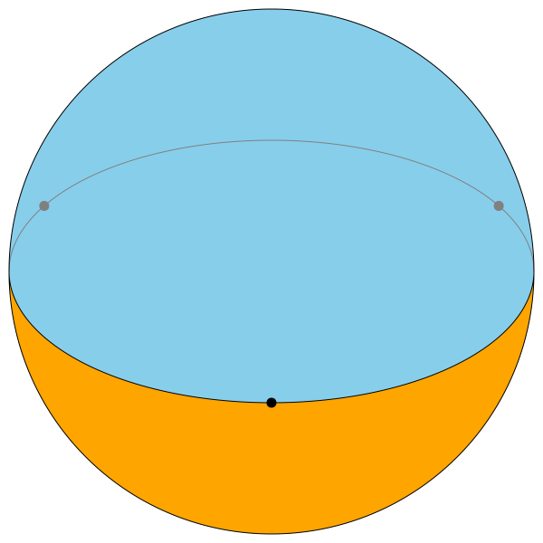
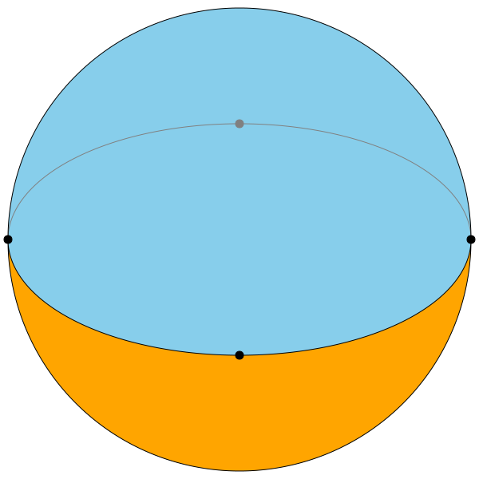
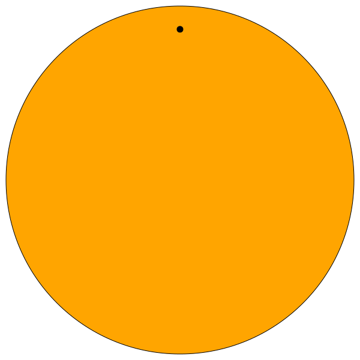

Appendix: Goldberg-Coxeter Operation on improper spherical polyhedra
====================================================================
There are some improper spherical polyhedra that cannot be tesselated with
the traditional geodesic dome methodology but can with some methods developed
earlier. The Naive Slerp methods are able to project a triangle or square
onto a full hemisphere, including the boundary.

Transformations to the disk
---------------------------
When the base vertices all lie on the same great circle (i.e. in a plane
through 0), Naive Slerp before projection or normalization
transforms the triangle or square to the disk. Unlike Triangular and
Quadrilateral #1 Naive Slerp, Quadrilateral #2 simplifies nicely on the disk. 
If the vertices of the quadrilateral are
:math:`\left<\pm 1, 0, 0\right>` and :math:`\left<0, \pm 1, 0\right>`,
and :math:`x,y` are the xy coordinates, then:

.. math::
   \hat{\mathbf v}^* = \left< \cos \left(\frac{\pi}{2}(x+y)\right),
   \sin \left(\frac{\pi}{2}(x-y)\right), 0 \right>

The radial coordinate `r` of this vector in polar form has a nice form.
(The angle coordinate :math:`\theta = \operatorname {arctan2} (v_y,v_x)`
doesn't simplify usefully.)

.. math::
   r = \sqrt{1 - \sin (\pi x) \sin (\pi y)}

There are also some disk-specific transformations, accessible with
``gcopoly -p=disk``. These amount to converting the vertex to polar form
and scaling the `r` variable. Unlike Naive Slerp, there are points where the
transformation is not smooth.

**Triangular:**

.. math::
    r = 1 - 3 \min(\beta_i)

.. math::
   \theta = \operatorname {arctan2} (\sum \beta_i v_{yi}, \sum \beta_i v_{xi})

**Quadrilateral:**

.. math::
    r = \max(|2x - 1|, |2y - 1|)

.. math::
    \theta = \operatorname {arctan2} (2y-1, 2x-1)

Dihedra
-------

   The 3-dihedron

   The 4-dihedron

With the transformations defined above, performing the GC operation on a
dihedron is fairly straightforward. These disk operations can be projected
with a k factor the same as naive slerp, although here we require k to be
`>0`: otherwise, all points would be projected onto the great circle.

The only caveat has to do with the
presence of vertices with valence 2. On the quadrilateral, the valence-2
vertex and its adjacent edges can be smoothed into a single edge. On the
triangle, this produces dangling faces, which can be removed. In both cases,
one can also add or switch edges so that the vertex is no longer degenerate.

The process of doing the GC operation on a dihedron resembles stitching
together two flat sheets and inflating them, like the children's novelty
the whoopi cushion. The dual of that could be called a Whoopi Goldberg
polyhedron. (Thank you, I'll be here all night.)

Monohedron
----------

   The monohedron.

The spherical monohedron is the "polyhedron" with one face, one vertex, and no
edges: the entire sphere is one big face. (Hey, it satisfies the Euler
equations.) Topologically, we can tile this
surface by taking the disk defined earlier and collapsing the boundary to a
single point. This amounts to projecting the disk in the manner of a
map projection of the entire Earth, which is a well-studied problem. Given
:math:`\theta = \arctan2(v_x, v_y)` and :math:`\mathbf{\hat{v}} =
(\sin(\phi) \cos(\theta), \sin(\phi) \sin(\theta), \cos(\phi))`,
two useful projections used in cartograph can be described as such:

**Lambert azimuthal equal-area:**

.. math::
    \phi = 2 \arcsin(\|\mathbf v\|)

**Azimuthal equal-distance:**

.. math::
    \phi = \pi \|\mathbf v\|

Really any continuous, monotonic function of :math:`\|\mathbf v\|` that
maps 0 to 0 and 1 to :math:`\pi` could be used to calculate :math:`\phi`.

We'll call these "balloon polyhedra" by analogy with blowing up a balloon.
``balloon.py`` can be used to calculate these. Because of the radical change
to the boundary, many small-parameter GC
operations produce the same polyhedron. Quad faces may be reduced to triangle
faces, and triangle faces may be reduced to degenerate faces. Many produced
polyhedra are not convex. Class III polyhedra tend to have dangling faces.
